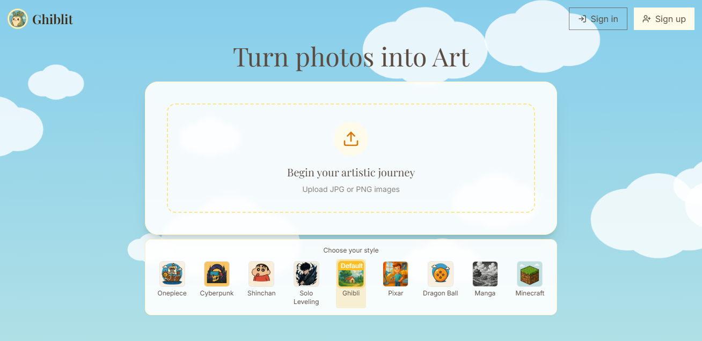

# Ghiblit.art

> Transform your photos into beautiful artwork with AI



## About Ghiblit

Ghiblit.art is a web app that transforms ordinary photos into stunning artwork inspired by various artistic styles. Upload any image and watch as AI transforms it into beautiful art in styles like Studio Ghibli, One Piece, Cyberpunk, and more. The application provides an intuitive interface for both creating and managing your artistic transformations.

## Features

- **Multiple Art Styles**: Choose from various artistic styles including Ghibli, One Piece, Cyberpunk, Solo Leveling, Shinchan, Pixar, Dragon Ball, Manga, and Minecraft
- **Instant Transformation**: Upload and transform your images in seconds
- **User Accounts**: Google account integration for seamless login and registration
- **Credit System**: Affordable credit system for transformations
- **Gallery View**: Browse through recent transformations for inspiration
- **Download & Share**: Easily download and share your transformed images
- **Mobile Responsive**: Works perfectly on desktop and mobile devices

## Tech Stack

### Frontend
- **Framework**: Next.js with React
- **Styling**: Tailwind CSS
- **Animation**: Framer Motion
- **Authentication**: Google OAuth via @react-oauth/google
- **Deployment**: Vercel

### Backend
- **Framework**: Django/Django REST Framework
- **Database**: PostgreSQL (Supabase)
- **Storage**: Supabase Storage
- **Authentication**: JWT (Simple JWT)
- **Image Processing**: OpenAI API, PIL (Python Imaging Library)
- **Payment Processing**: Dodo Payments
- **Deployment**: Render

## Local Development Setup

### Prerequisites
- Python 3.9+
- Node.js 16+
- npm or yarn
- OpenAI API key
- Google OAuth credentials

### Backend Setup

```bash
# Clone the repository
git clone https://github.com/pranesh-j/ghibliz
cd ghibliz/backend/ghiblit

# Create a virtual environment
python -m venv env
source env/bin/activate  # On Windows, use `env\Scripts\activate`

# Install dependencies
pip install -r requirements.txt

# Create a .env file with necessary environment variables
# See Environment Variables section below

# Run migrations
python manage.py migrate

# Create default pricing plans
python manage.py create_pricing_plans

# Run the server
python manage.py runserver
```

### Frontend Setup

```bash
# Navigate to the frontend directory
cd ../../frontend/ghiblit

# Install dependencies
npm install  # or yarn install

# Create a .env.local file with necessary environment variables
# See Environment Variables section below

# Run the development server
npm run dev  # or yarn dev
```

## Deployment

The application is deployed with:
- Frontend hosted on Vercel
- Backend hosted on Render
- Database hosted on Supabase
- Storage provided by Supabase

## Environment Variables

For local development, create these `.env` files:

### Backend (.env)
```
SECRET_KEY=your_django_secret_key
DEBUG=True
ALLOWED_HOSTS=localhost,127.0.0.1
OPENAI_API_KEY=your_openai_api_key
GOOGLE_CLIENT_ID=your_google_client_id
```

### Frontend (.env.local)
```
NEXT_PUBLIC_API_URL=http://localhost:8000
NEXT_PUBLIC_GOOGLE_CLIENT_ID=your_google_client_id
```

> **Note:** The application uses additional services in production (database as Postgres instanace from Supabase, and dodo payments for payment gatway), but for local development, Django's default SQLite database and file storage are sufficient to get started..

## Key Directories

- **backend/ghiblit**: Django backend application
  - **api**: API endpoints and authentication
  - **images**: Image transformation logic
  - **payments**: Payment processing and credits system
  - **users**: User management
  - **config**: Django settings and configuration

- **frontend/ghiblit**: Next.js frontend application
  - **src/app**: Next.js pages and routes
  - **src/components**: React components
  - **src/contexts**: React context providers
  - **src/services**: API service modules
  - **public**: Static assets

## Contributing

Contributions are welcome! Please feel free to submit a Pull Request.

## License

This project is licensed under the MIT License - see the LICENSE file for details.

## Contact

For questions or support, please email [ghiblit.art@gmail.com](mailto:ghiblit.art@gmail.com).

---

Built with ❤️ by [Pranesh Jahagirdar](https://www.linkedin.com/in/pranesh-jahagirdar/)
